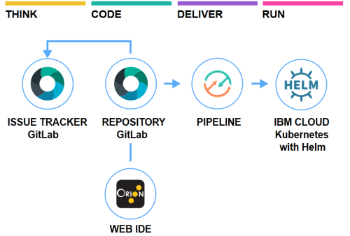

#  Simple Kubernetes with Helm toolchain

### Continuously deliver a secure Docker app to a Kubernetes Cluster using a Helm Chart
This Hello World application uses Docker and Kubernetes Helm in a DevOps toolchain preconfigured for 
continuous delivery to a Kubernetes cluster. It automates numerous tasks such automatic triggering from Git
commits, issue tracking, online editing, automatic linting of files, configuration of target cluster permissions to private image registry, etc... through a preconfigured Delivery Pipeline.

### To get started, click this button:

### Use it with your own application:
This template assumes an application (e.g. [hello-helm](https://github.com/open-toolchain/hello-helm)) structured like this  :
- **/Dockerfile (must)** -- the docker file used to build the container image in root folder
- **/chart /your-app-name  (must)** -- the Helm Chart used to deploy this application, CI pipeline will automatically update it to reflect latest image build

It implements the following best practices:
- NOT YET - perform unit tests prior to building a container image (could be revisited to only occur after, or using a multistage build)
- sanity check the Dockerfile prior to attempting creating the image
- build container image once, and stage it through various Kubernetes environments (staging and prod, but could be further expanded by cloning pipeline stages)
- use a private image registry to store the built image, automatically configure access permissions for target cluster deployment using tokens than can be revoked
- check container image for security vulnerabilities
- use a Helm chart to conduct the deployment of each release
- use an explicit namespace in cluster to insulate each deployment (and make it easy to clear, by "kubectl delete namespace <name>")

---
### Learn more 

* TBD Blog [Continuously deliver your app to Kubernetes with Bluemix](https://www.ibm.com/blogs/bluemix/2017/07/continuously-deliver-your-app-to-kubernetes-with-bluemix/)
* [tutorial](https://www.ibm.com/cloud/garage/tutorials/tc-simple-kube-helm)
* [Getting started with Bluemix clusters](https://console.bluemix.net/docs/containers/container_index.html?pos=2)
* [Getting started with toolchains](https://bluemix.net/devops/getting-started)
* [Documentation](https://console.ng.bluemix.net/docs/services/ContinuousDelivery/index.html?pos=2)

More links
* https://github.com/kubernetes/helm/blob/master/docs/charts_tips_and_tricks.md
* https://kubernetes.io/docs/tasks/configure-pod-container/pull-image-private-registry/
* http://helm.readthedocs.io/en/latest/awesome/
* https://kubernetes.io/docs/concepts/containers/images/#using-a-private-registry
* https://www.ibm.com/blogs/bluemix/2017/03/whats-secret-pull-image-non-default-kubernetes-namespace-ibm-bluemix-container-service/
* https://console.bluemix.net/docs/containers/cs_tutorials.html#cs_tutorials
* https://console.bluemix.net/docs/containers/cs_cluster.html#cs_apps_images
